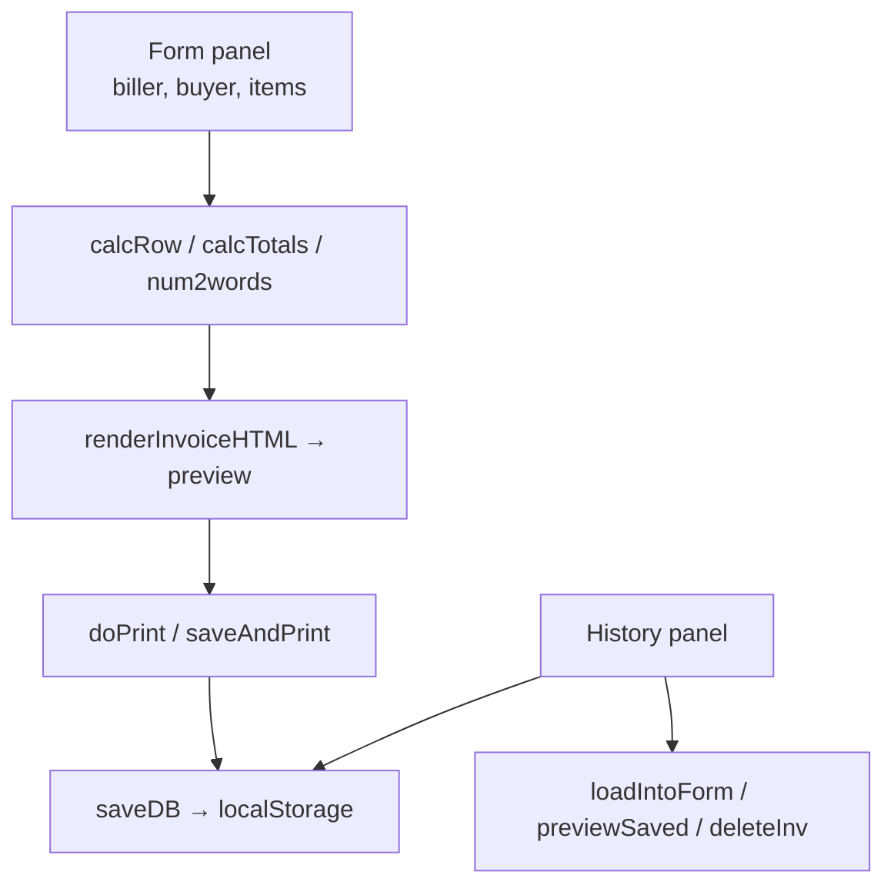

# Biller — GST Invoice Generator (Spazorlabs LLP)

**A single-file, offline GST invoice generator with automatic numbering, tax totals, amount-in-words, printing and local history.**

     

**Biller** is a self-contained invoice generator (one 90 KB `index.html`) titled *Spazorlabs LLP — Invoice Generator*.
It runs entirely in the browser: fill in the biller, buyer (with a one-click "copy buyer" to payer), invoice date, place
of supply and line items with HSN/SAC codes; the page calculates each row's pre-tax amount and tax, shows CGST/SGST/IGST
and grand totals, converts the total to words, and renders a print-ready invoice. Invoices get automatic numbers in the
format **SPZ/<financial-year>/<0001>**, duplicates are blocked, and every saved invoice goes into an on-device **history**
(browser `localStorage`) where it can be previewed, re-loaded into the form, reprinted or deleted.

No data leaves the device and nothing needs installing. The trade-off: history exists only in that one browser profile.

## Table of contents

1. [At a glance](#at-a-glance)
2. [Key features](#key-features)
3. [Tech stack](#tech-stack)
4. [Architecture in one picture](#architecture-in-one-picture)
5. [Repository structure](#repository-structure)
6. [Getting started](#getting-started)
7. [Configuration](#configuration)
8. [Available scripts](#available-scripts)
9. [Testing](#testing)
10. [Deployment](#deployment)
11. [Documentation](#documentation)
12. [Project status](#project-status)
13. [Contributing](#contributing)
14. [Security](#security)
15. [Licence](#licence)
16. [Contacts](#contacts)

## At a glance

|  |  |
|---|---|
| What it is | A one-page invoice maker for Spazorlabs LLP - fill in biller, buyer and line items, and print a professional GST invoice. |
| Who it is for | Spazorlabs LLP staff issuing invoices; small businesses needing simple GST invoices. |
| Status | Active — internal tool |
| Primary language | HTML / CSS / JavaScript (single file) |
| Hosting | Static file — open index.html in a browser (no server) |
| Repository | Public — `HiravK/Biller` |
| Default branch | `main` |
| Commits / first / latest | 2 commits · 2026-04-01 → 2026-04-01 |
| Contributors | Hirav K (2) |

## Key features

- **Invoice form** — Biller, buyer, payer (copy from buyer), invoice number/date, place of supply, currency, GSTINs
- **Line items** — Add/delete rows, header rows, HSN/SAC list (9983xx services), quantity × rate, tax rate → pre-tax and tax per row
- **Totals** — Pre-tax total, total tax, CGST and SGST (half each), IGST, grand total; amount in words (num2words)
- **Numbering** — SPZ/<FY>/<4-digit counter> with duplicate check
- **Preview and print** — Rendered invoice HTML and browser print (save as PDF)
- **History** — Saved invoices in localStorage - list, count, preview, load into form, delete, clear all

## Tech stack

| Layer | Technology | Why it is used |
|---|---|---|
| UI | HTML + CSS | Form and invoice layout |
| Logic | Vanilla JavaScript | Calculations, numbering, history |
| Storage | localStorage | Persistence per browser |

## Architecture in one picture



Full detail: [docs/ARCHITECTURE.md](docs/ARCHITECTURE.md).

## Repository structure

```text
Biller/
└── index.html   # the whole application
```

## Getting started

### Prerequisites

- Any modern browser

### Install and run locally

```bash
git clone https://github.com/HiravK/Biller.git
open Biller/index.html      # or double-click it
```

## Configuration

No environment variables or secrets are required.

## Available scripts

| Command | What it does |
|---|---|
| `open index.html` | Run the app |

## Testing

No automated tests; verify with the checks below. See [docs/PROJECT.md](docs/PROJECT.md#quality-and-testing).

## Deployment

No deployment needed. Optionally host as a static page (GitHub Pages/Vercel) — history stays per browser. Step-by-step: [docs/RUNBOOK.md](docs/RUNBOOK.md).

## Documentation

Every document below is part of the project's controlled documentation set.

| Document | Audience | What it answers |
|---|---|---|
| [README](README.md) | Everyone | What is it, how do I run it, where is everything? |
| [Project Overview (in depth)](docs/PROJECT.md) | Everyone | Why it exists, every feature explained, timeline, quality, security, risks, glossary |
| [Product Requirements (PRD)](docs/PRD.md) | Product, business, engineering | What problem, for whom, what must it do, how is success measured? |
| [Architecture](docs/ARCHITECTURE.md) | Engineers, architects | How is it built, how does data flow, where does it run, why? |
| [Runbook](docs/RUNBOOK.md) | Engineers, operators | How do I set it up, configure, deploy, roll back and troubleshoot it? |
| [Session Handover](docs/SESSION_HANDOVER.md) | Next owner / next session | Where exactly did work stop and what is next? |

## Project status

Built and refined on 2026-04-01 for Spazorlabs LLP. It works offline and keeps history in the browser. Two correctness
issues should be fixed before relying on it for statutory invoices (see known issues).

Latest hand-off notes: [docs/SESSION_HANDOVER.md](docs/SESSION_HANDOVER.md).

## Contributing

Branch from the default branch (`feat/…`, `fix/…`), use Conventional Commit messages, open a pull request, and update the docs in the same PR.

## Security

Please do not open public issues for vulnerabilities; contact the maintainer privately. Security design is covered in [docs/PROJECT.md](docs/PROJECT.md#security-and-privacy).

## Licence

No licence file is present, so all rights are reserved by the owner by default. Add a `LICENSE` file before accepting outside contributions or reuse.

## Contacts

| Role | Name | Contact |
|---|---|---|
| Owner / maintainer | Hirav Kadikar | [@HiravK](https://github.com/HiravK) |
