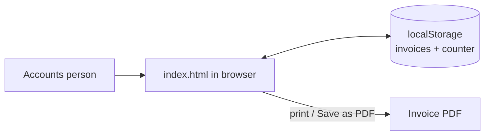
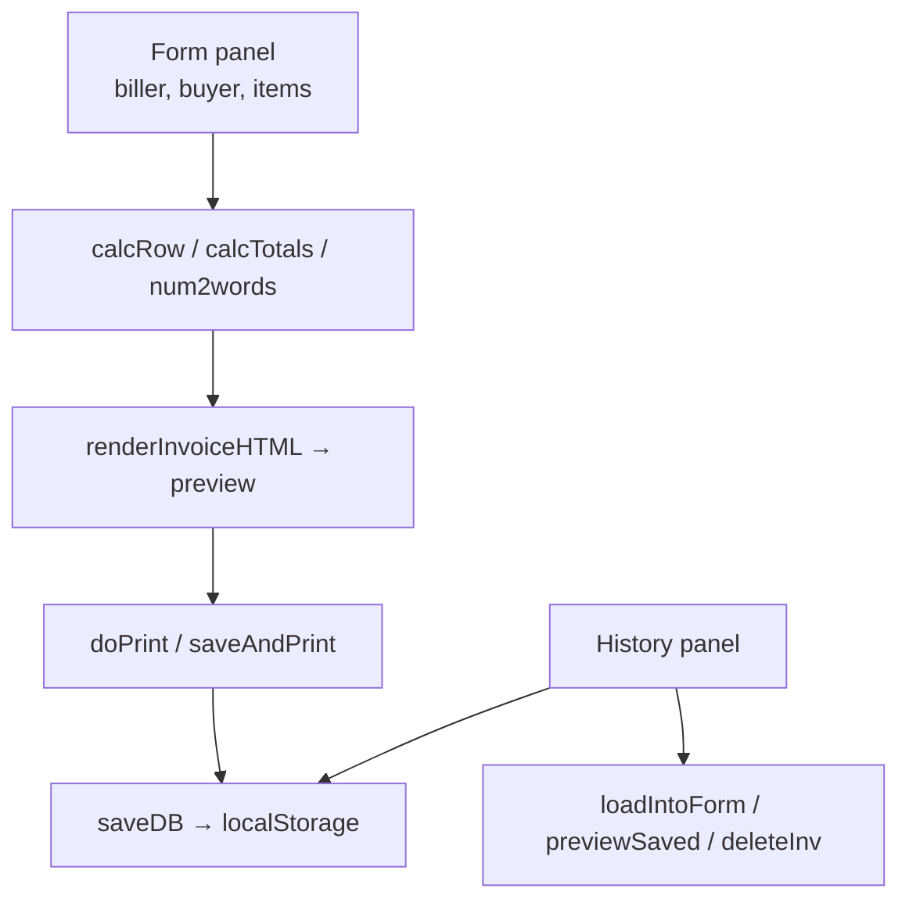

# Architecture Document — Biller — GST Invoice Generator (Spazorlabs LLP)

| Field | Value |
|---|---|
| Document ID | BILLER-ARCH |
| Project | Biller — GST Invoice Generator (Spazorlabs LLP) |
| Repository | [`HiravK/Biller`](https://github.com/HiravK/Biller) |
| Version | 1.0 |
| Status | Approved — living document |
| Owner | Hirav Kadikar |
| Classification | Public |
| Last updated | 2026-09-25 |

> **Purpose:** Explains how the system is built: its parts, how data moves, where it runs, and why it was built this way. Structured on the C4 model and arc42.

## 1. Revision history

| Version | Date | Author | Change |
|---|---|---|---|
| 1.0 | 2026-09-25 | Hirav Kadikar | Full documentation suite generated from a complete review of the repository. |

## 2. Introduction and goals

One static HTML file containing markup, CSS and vanilla JavaScript. Two panels (form and history) are switched in the
page. JavaScript collects the form into an object (`collectData`), renders the printable invoice (`renderInvoiceHTML`),
and persists invoices as a JSON array in `localStorage` (`loadDB` / `saveDB`) alongside a counter used by
`generateInvNo`. Printing uses the browser's print dialog.

### Quality goals (in priority order)

| Priority | Quality attribute | What it means here |
|---|---|---|
| 1 | Correctness | Totals and tax heads must be right |
| 2 | Simplicity | One file, no install |
| 3 | Privacy | Data stays on the device |

## 3. Constraints

- Single HTML file; no build step, no backend.

## 4. System context (C4 level 1)

Who and what the system talks to.

| External actor / system | Interaction |
|---|---|
| Browser localStorage | Invoice history and counter |
| Browser print | PDF output |

## 5. Containers (C4 level 2)

## 6. Components (C4 level 3)

| Component | Location | Responsibility |
|---|---|---|
| Form and items | `index.html (addRow, delRow, calcRow, copyBuyer)` | Data entry and per-row math |
| Totals | `index.html (calcTotals, num2words)` | Tax heads, grand total, amount in words |
| Numbering | `index.html (getNextCounter, generateInvNo, isInvNoDuplicate)` | SPZ/FY/NNNN |
| Rendering and print | `index.html (generatePreview, renderInvoiceHTML, doPrint, saveAndPrint)` | Printable invoice |
| History | `index.html (loadDB, saveDB, renderHistory, previewSaved, loadIntoForm, deleteInv, clearHistory)` | Local storage |

## 7. Runtime view — key flows

_Single-step flows only; see components._

## 8. Data architecture

Invoices are stored as a JSON array under one `localStorage` key, with a separate counter key for numbering. Each
invoice holds biller, buyer, payer, dates, items and totals. Nothing is sent to a server.

## 9. Deployment view

No deployment needed. Optionally host as a static page (GitHub Pages/Vercel) — history stays per browser.

| Environment | Where | Notes |
|---|---|---|
| Local | Double-click index.html | Works offline |

## 10. Technology stack

| Layer | Technology | Why |
|---|---|---|
| UI | HTML + CSS | Form and invoice layout |
| Logic | Vanilla JavaScript | Calculations, numbering, history |
| Storage | localStorage | Persistence per browser |

## 11. Cross-cutting concepts

## 12. Architecture decisions (ADR log)

### ADR-01: Single static file with localStorage

|  |  |
|---|---|
| Status | Accepted |
| Date | 2026-04-01 |
| Context | Needed an invoice tool immediately with zero hosting. |
| Decision | Build one self-contained HTML file; store history in localStorage. |
| Consequences | Works offline, private; History is per browser and can be lost |
| Alternatives considered | — |

## 13. Quality scenarios

_None recorded._

## 14. Risks and technical debt

Full register in [PROJECT.md](PROJECT.md#risks-and-technical-debt). Top items:

- **Incorrect tax heads or FY on statutory invoices** — Fix before use; review by accountant
- **Invoice history lost** — Export + PDF archive

## 15. Glossary

See [PROJECT.md](PROJECT.md#glossary).
